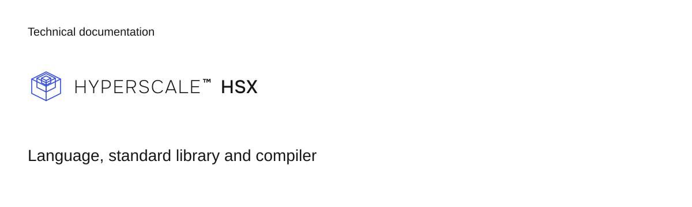

# HSX

HSX is the strictly typed programming language for money on the Hyperscale operating system. It defines general instruments, composes money flows from the money flows library (open/hsx/std), checks currency-indexed linear money, and calculates deterministic execution costs at compile time. HSX compiles each accepted program to canonical UDL. It does not execute settlements, open network sockets, or manage provider accounts.

## Install

```sh
npm install @hyperscale0/hsx @hyperscale0/udl
```

Install the compiler globally or run it with `npx`:

```sh
npm install -g @hyperscale0/hsx
```

The VS Code extension package is available at https://hyperscale0.ai/downloads/hsx-vscode.vsix. The extension runs `hsx lsp` over stdio to provide diagnostics and document formatting.

## First program

`tip-jar.hsx` is an example HSX program that moves money:

```hsx
program tip_jar "Tip jar"

import { instant_transfer } from "std/money_flows"

party listener: person
party host: business

settlement tip = instant_transfer {
  payer: listener
  payee: host
  amount: tipAmount: money(SAR)
}
```

Check the program with the CLI:

```sh
hsx check tip-jar.hsx
```

Compile it to canonical UDL:

```sh
hsx build tip-jar.hsx --out tip-jar.udl.json
```

The CLI exits 0 for an accepted program, 1 for a refused program, and 2 when the command line or input file cannot be used.

In TypeScript, compile a source string directly:

```ts
import { compile } from "@hyperscale0/hsx";

const result = compile(source, { costTable });
if (result.verdict !== "invalid" && result.artifacts) {
  const { document, originMap, costManifest } = result.artifacts;
}
```

Programmatic compilation requires a `costTable` parameter. See the [cost documentation](docs/guide/09-cost.md#cost) for table structure and pricing semantics. The compiler returns three artifacts: `document` (the canonical UDL value), `originMap` (UDL paths mapped to source spans), and `costManifest` (deterministic compile-time costs).

## Documentation

- [Guide and reading order](docs/README.md)
- [Your first program](docs/guide/01-first-program.md)
- [Standard library examples](examples/README.md)
- [Browser playground](docs/playground.md)
- [Compiler and language reference](docs/reference/)
- [Contributing](CONTRIBUTING.md)

## License and security

HSX is licensed under AGPL-3.0-only, with a commercial license available from Hyperscale LLC. See [LICENSE](LICENSE), [LICENSING.md](LICENSING.md), and [TRADEMARKS.md](TRADEMARKS.md).

Vulnerability reports go through private disclosure as described in [SECURITY.md](SECURITY.md).
